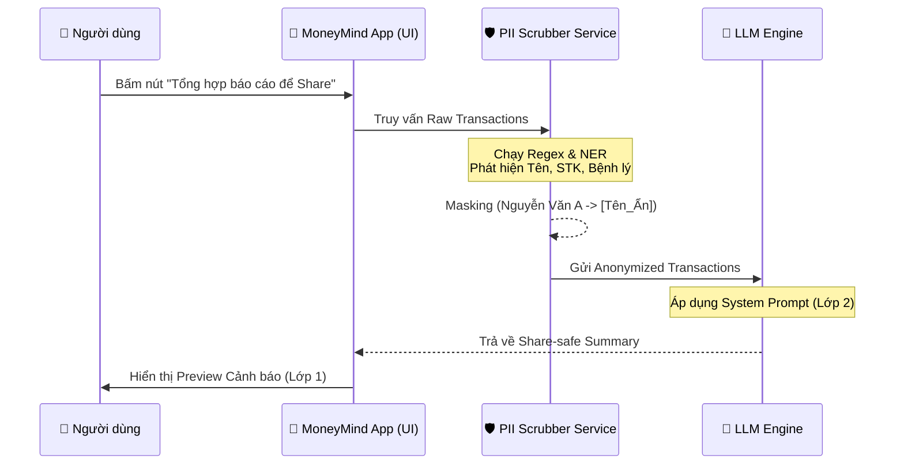

# demo.md — Demo kiến trúc dữ liệu (PII Scrubber Flow)

---

## 1. Sơ đồ cách hệ thống xử lý (Mermaid)



---

## 2. Thành phần chính (Data Transformation)

**Payload Gốc (Raw Data từ App gửi đi):**
```json
{
  "transactions": [
    {
      "id": "T01",
      "amount": 5000000,
      "category": "Chuyển khoản",
      "description": "Chuyển cho Nguyễn Văn A trả nợ lô đề STK 123456789"
    }
  ]
}
```

**Payload Sau khi qua Scrubber (Được đưa vào LLM):**
```json
{
  "transactions": [
    {
      "id": "T01",
      "amount": 5000000,
      "category": "Thanh toán tín dụng cá nhân",
      "description": "Chuyển cho [PERSON] mục đích [DEBT] STK [REDACTED]"
    }
  ]
}
```

| Thành phần | Nhận gì? | Làm gì? | Trả ra gì? |
|---|---|---|---|
| PII Scrubber | Dữ liệu giao dịch thô (Raw) | Chạy mô hình NER nhận diện thực thể tên, số, và keyword nhạy cảm ("nợ", "bệnh") để thay thế bằng thẻ (tags) ẩn danh. | Dữ liệu giao dịch đã ẩn danh (Anonymized Data) |
| LLM Engine | Anonymized Data & User Prompt | Phân tích và viết tóm tắt dựa trên dữ liệu không còn thông tin định danh cá nhân. | Báo cáo tóm tắt an toàn (Share-safe Summary) |

---

## 3. Khi hệ thống gặp vấn đề

| Khi nào lỗi xảy ra? | Hệ thống làm gì? | Người dùng thấy gì? |
|---|---|---|
| PII Scrubber bị quá tải/time-out | Ngắt luồng gọi LLM, không sinh báo cáo bằng AI. | Fallback: Hiển thị báo cáo thống kê tĩnh (biểu đồ tròn) do app tự vẽ, kèm thông báo "AI đang bận". |
| Dịch vụ nhận diện tên người (NER) bị sai sót | Mask nhầm các từ không nhạy cảm (vd: Quán Phở Bà Tám -> Phở [PERSON]). | Báo cáo hiển thị có chút kỳ quặc, nhưng ưu tiên An toàn (False Positive tốt hơn False Negative). |

---

## 4. Kiểm tra nhanh

- [x] Sơ đồ không chỉ là “AI trả lời tốt hơn”, mà có bước kiểm tra cụ thể (PII Scrubber đứng trước LLM).
- [x] Có cách xử lý khi thiếu dữ liệu / lỗi Scrubber (Fallback biểu đồ tĩnh).
- [x] Thể hiện rõ việc Data Minimization trước khi tới LLM.
